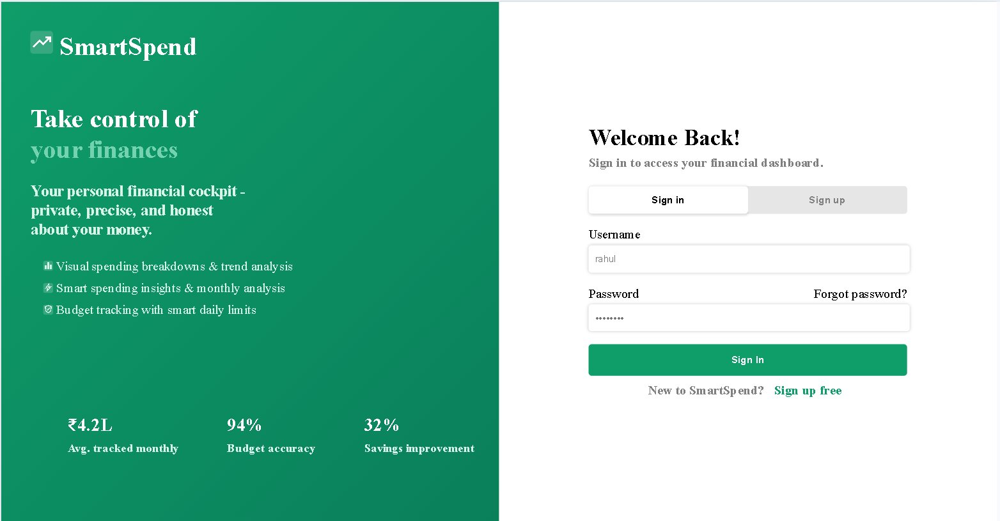
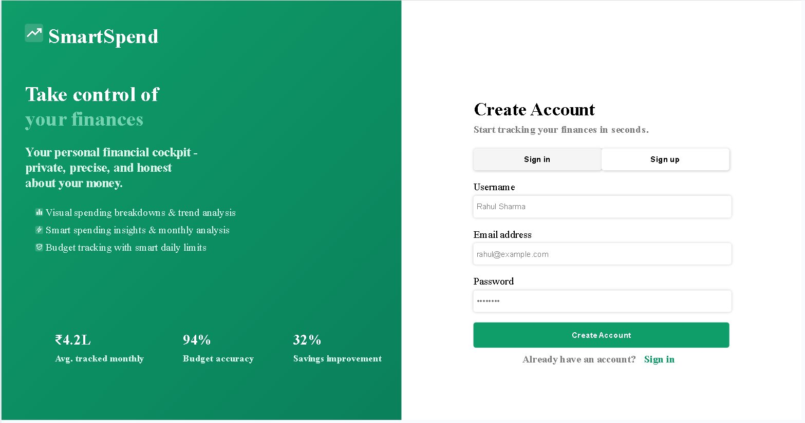
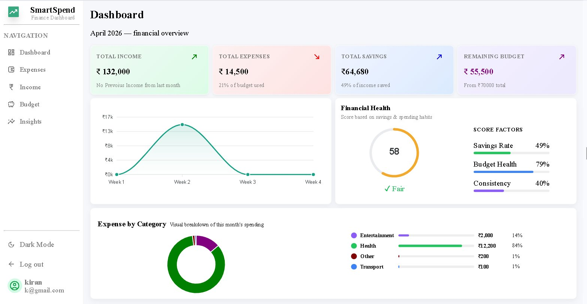
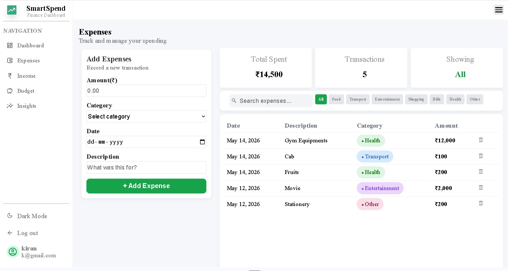
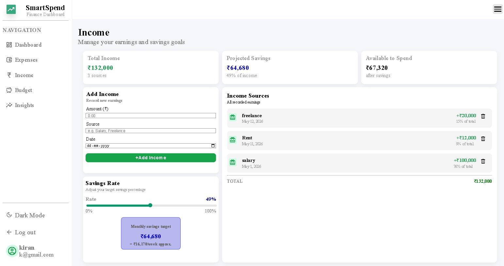
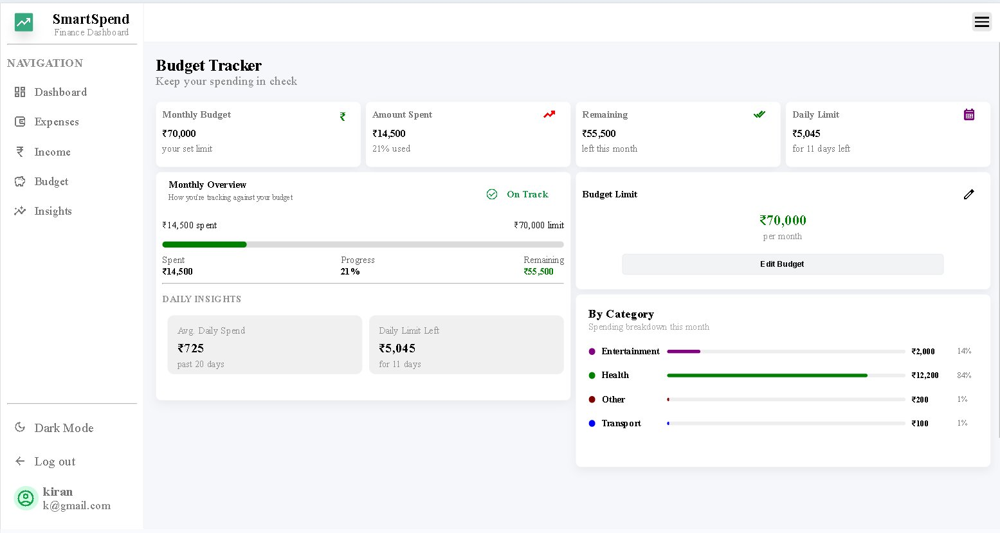
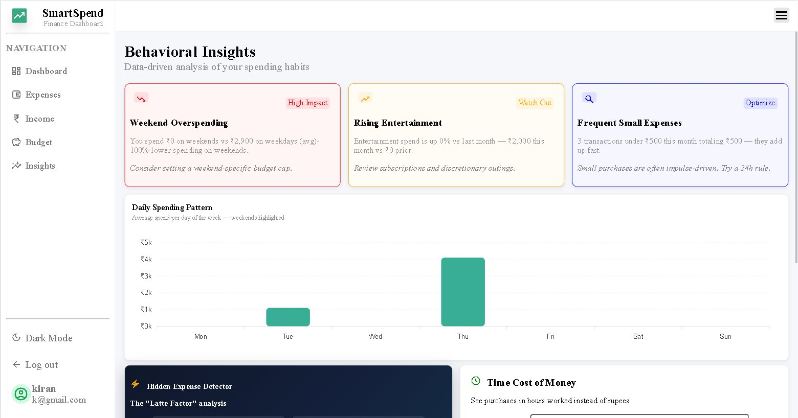
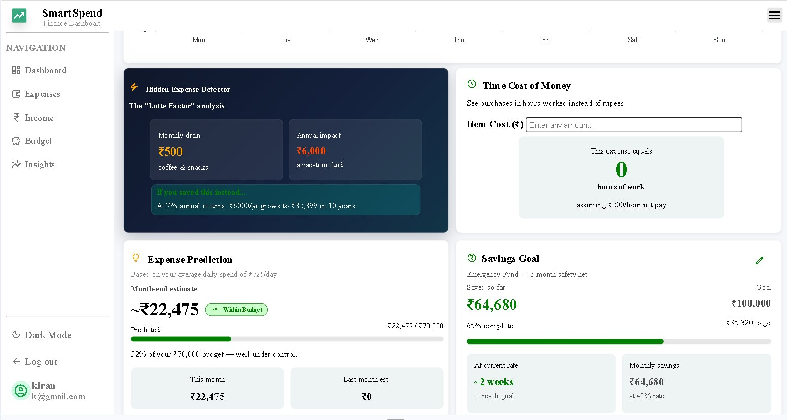

# 💸 SmartSpend

<div align="center">



**Your personal financial cockpit — private, precise, and honest about your money.**

[](https://python.org)
[](https://djangoproject.com)
[](https://sqlite.org)
[](LICENSE)

</div>

---

## 📖 About

**SmartSpend** is a full-stack personal finance dashboard built with Django. It helps you track expenses, manage budgets, analyze income sources, and gain behavioral insights into your spending habits — all in one clean, intuitive interface.

---

## ✨ Features

### 🔐 Authentication
Secure sign-up and login system with user-specific data isolation.




---

### 📊 Dashboard
Get a complete financial snapshot at a glance — income, expenses, savings, remaining budget, weekly spending trends, and a **Financial Health Score** based on your savings rate, budget health, and consistency.



---

### 💳 Expense Tracker
Log expenses with amount, category, date, and description. Filter by category (Food, Transport, Entertainment, Shopping, Bills, Health, Other) and search through all transactions.



---

### 💰 Income Manager
Record multiple income sources (Salary, Freelance, Rent, etc.), set your savings rate target, and see projected savings and available-to-spend amounts — updated in real time.



---

### 📅 Budget Tracker
Set a monthly budget and track your spending progress. Get daily spend limits, monthly overviews, and a category-wise breakdown to stay on track.



---

### 🧠 Behavioral Insights
The most powerful feature — data-driven analysis of your spending habits including:
- **Weekend Overspending** alerts
- **Rising category** detection
- **Frequent small expense** ("Latte Factor") analysis
- **Daily spending patterns** chart
- **Expense Prediction** for month-end
- **Savings Goal tracker** (e.g. Emergency Fund)
- **Time Cost of Money** calculator — see purchases in hours of work




---

## 🛠️ Tech Stack

| Layer      | Technology                        |
|------------|-----------------------------------|
| Backend    | Python · Django                   |
| Frontend   | HTML5 · CSS3 · JavaScript         |
| Database   | SQLite3                           |
| Charts     | JavaScript (Canvas/Chart.js)      |
| Mobile     | `smartspendapp/` (companion app)  |

---

## 📁 Project Structure

```
smartSpend/
├── smartspendweb/          # Django web application
│   ├── templates/          # HTML templates
│   ├── static/             # CSS, JS, images
│   ├── views.py            # App logic & calculations
│   ├── models.py           # Database models
│   └── urls.py             # URL routing
├── smartspendapp/          # Mobile companion app
├── manage.py               # Django management script
└── db.sqlite3              # SQLite database
```

---

## ⚙️ Getting Started

### Prerequisites

- Python 3.8+
- pip

### Installation

```bash
# 1. Clone the repository
git clone https://github.com/kiranpreet6862/smartSpend.git
cd smartSpend

# 2. Create and activate a virtual environment
python -m venv venv
source venv/bin/activate        # Windows: venv\Scripts\activate

# 3. Install dependencies
pip install -r requirements.txt

# 4. Apply migrations
python manage.py migrate

# 5. (Optional) Create a superuser for admin access
python manage.py createsuperuser

# 6. Run the development server
python manage.py runserver
```

Open your browser at **http://127.0.0.1:8000** and sign up to get started!

---

## 🤝 Contributing

Contributions are welcome!

1. Fork the project
2. Create your feature branch (`git checkout -b feature/AmazingFeature`)
3. Commit your changes (`git commit -m 'Add AmazingFeature'`)
4. Push to the branch (`git push origin feature/AmazingFeature`)
5. Open a Pull Request

---

## 📄 License

This project is open source and available under the [MIT License](LICENSE).

---

## 👨‍💻 Author

**Kiranpreet** — [@kiranpreet6862](https://github.com/kiranpreet6862)

---

<div align="center">
  <i>Made with ❤️ to make personal finance simple, smart, and stress-free.</i>
</div>
